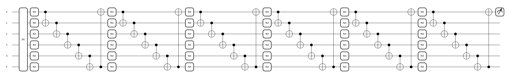
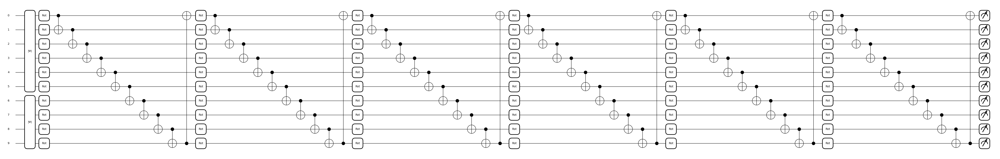

#  Single pixel imaging with classical and quantum neutral network [classical-quantum-mnist]

Single-pixel cameras can be a great solution for the light outside of the visible spectrum. In combination with machine learning, they will allow to quickly obtain images for the practical applications. In the future of the development of quantum technologies, quantum computers can further speed up the solution of such problems. In this work we simulated a single-pixel detection experiment using Hadamard basis patterns, where images from the MNIST are used as objects. 64 measurements (6% of the number of pixels in the image) with maximum variance were selected. The algorithms for classifying and reconstucting images in single-pixel experiment using classical fully connected neural networks and quantum variational circuits were created. Quantum neural networks were used for the first time to solve this type of problem.

## Repository description

Here you can find four jupyther notebooks written in python. Every library you need need will be installed in notebooks, except torch.

<table>
    <tr>
        <th>Filename</th>
        <th>Description</th>
    </tr>
    <tr>
        <td>Classical_Classification_with_noise.ipynb</td>
        <td>"single-pixel images" (64 measurements in Hadamard patterns basis) were classified using fully-connected network</td>
    </tr>
    <tr>
        <td>Classical_Reconstruction.ipynb</td>
        <td>"single-pixel images" were reconstrusted by the fully-connected network</td>
    </tr>
    <tr>
        <td>Quantum_Classification.ipynb</td>
        <td>"single-pixel images" were classified using quantum neural network (variational quantum circuits)</td>
    </tr>
    <tr>
        <td>Quantum_Reconstruction_dense.ipynb</td>
        <td>attempt of "single-pixel images" reconstruction using quantum neural network</td>
    </tr>
</table>

Each file consists of creating the dataset of measurements in single-pixel experiment from the MNIST, model and training (with loss plot).

## Models architecture and description

- Classical classifier

For the classic solution, fully connected linear neural networks were used. The architecture of the classifier consists of two hidden layers (128 and 10 neurons, respectively, that is, 9610 trainable parameters). Cross-Entropy loss was used as a metric for the classification task.

Other parameters: number of epochs – 6, activation function – ReLu, optimizer – Adam, learning rate – 0.001

- Classical reconstruction

The architecture consists of five hidden layers (1000, 2000, 4000, 2000 and 1024 neurons, that is, 20,122,024 trainable parameters). MSE was used as a metric for the regression problem of image restoration.

Other parameters: number of epochs – 6, activation function – ReLu, optimizer – Adam, learning rate – 0.001

- Quantum classifier

To develop the quantum algorithm for classifying “single-pixel images” using quantum neural networks the variational quantum circuit was created. The circuit consists of 6 qubits (log2 64), where “single-pixel image” can be encoded using amplitude embedding, 6 layers of the same type with different trainable parameters (in total 1090 angles of qubits rotations - trainable parameters) and one measurement of the observable on first qubit. This circuit is a binary classifier that determines the probability of our data to belong to one of the classes or to all others (it solves a binary problem, where 1 means belonging to this class, -1 to some of the others). Thus, for classification into 10 classes, we need 10 binary classifiers, each has its own set of parameters and training independently of the others.

Other parameters: number of epochs – 3, loss function – Margin loss, margin = 0.15, optimizer – Adam, learning rate – 0.01

- Quantum reconstruction

For the task of quantum image reconstruction, the architecture of a variational quantum circuit was assumed consisting of 10 qubits, 6 of which were initialized in a state defined as AmplitudeEmbedding(measurements) and the others in zero state, so we can measure the probabilities for each state, which are 1024 numbers.

Other parameters: number of epochs – 1, loss function – MSE, optimizer – Adam, learning rate – 0.01

## Research results

- the classical classifier showed an accuracy of 97% after six training epochs
- the quantum classifier showed an accuracy of 93% after three (because simulating is too long) training epochs
- image reconstruction using a classical neural network showed 7% mean square error after six training epochs
- the quantum neural network for reconstructing didn't show good results. I assume that this is due to dense encoding and trying to relate probability measurements to image pixels. Measurements of this type turn out to be highly correlated as a result of calculations, since the qubits in the circuit become entangled. Thus, the model turned out to be unsuitable for solving such a problem.

**Here you can find the more detailed results of the research:** 
