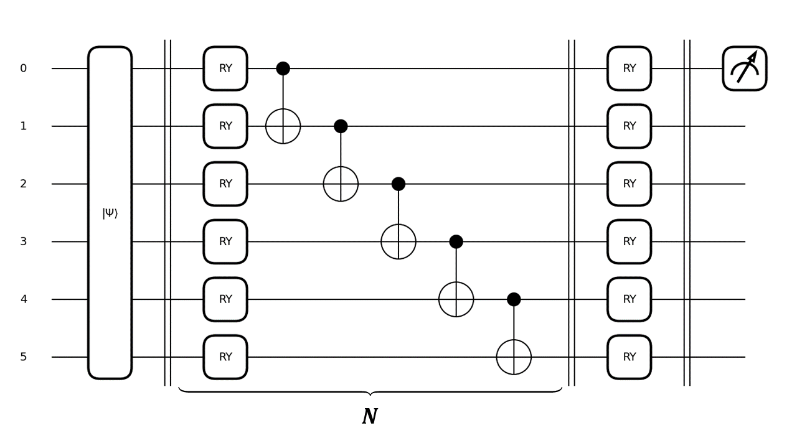

#  Single pixel imaging with classical and quantum neutral networks [classical-quantum-mnist]

[](https://rdcu.be/d9wvF)
[](https://arxiv.org/abs/2407.12506)
[](https://pytorch.org/)
[](https://pennylane.ai/)

Single-pixel cameras can be a great solution for the light outside of the visible spectrum. In combination with machine learning, they will allow to quickly analyze images for the practical applications. In the future development of quantum technologies, quantum computers can further speed up the solution of such problems. In this work we simulated a single-pixel detection experiment using Hadamard basis patterns, where images from the MNIST are used as objects. 64 measurements (6% of the number of pixels in the image) with maximum variance were selected. The algorithms for classifying and reconstucting images in single-pixel experiment using classical fully connected neural networks and quantum variational circuits were created. Quantum neural networks were used for the first time to solve this type of problem.

## Repository description

For installing project dependencies use:

```bash
pip install -r requirements.txt
```

Here you can find four jupyther notebooks written in python.
<table>
    <tr>
        <th>Filename</th>
        <th>Description</th>
    </tr>
    <tr>
        <td>Classical_Classification.ipynb</td>
        <td>"Single-pixel images" (measurements in Hadamard patterns basis) were classified using fully-connected network. The dependence of it's result on the number of measurements in the input layer of the neural network was studied.</td>
    </tr>
    <tr>
        <td>Classical_Reconstruction.ipynb</td>
        <td>"Single-pixel images" were reconstrusted by the fully-connected network. The quality of reconstruction depending on the number of measurements was studied.</td>
    </tr>
    <tr>
        <td>Quantum_Classification.ipynb</td>
        <td>"Single-pixel images" were classified using quantum neural network (variational quantum circuits).</td>
    </tr>
    <tr>
        <td>Quantum_Reconstruction.ipynb</td>
        <td>"Single-pixel images" were reconstructed by the quantum neural network.</td>
    </tr>
</table>

Each file consists of creating the dataset of measurements in single-pixel experiment from the MNIST, model and training (with loss plot).

## Models architecture and description

- <span style="font-size:1.25em;">**Classical classifier [PyTorch]**</span>

For the classic solution, fully connected linear neural networks were used. The architecture of the classifier consists of one hidden layers of 128 neurons, which is 9610 trainable parameters. \
Other parameters: number of epochs – 6, loss function - Cross-Entropy loss, activation function – ReLu, optimizer – Adam, learning rate – 0.0001.

<p align="center"></p>
&nbsp;

- <span style="font-size:1.25em;">**Classical reconstruction [PyTorch]**</span>

The architecture consists of four hidden layers (1000, 2000, 4000 and 2000 neurons, that is, 20,122,024 trainable parameters). \
Other parameters: number of epochs – 10, loss function - MSE, activation function – ReLu, optimizer – Adam, learning rate – 0.0001.

<p align="center"></p>
&nbsp;

- <span style="font-size:1.25em;">**Quantum classifier [PennyLane]**</span>

To develop the quantum algorithm for classifying “single-pixel images” using quantum neural networks the variational quantum circuit was created. The circuit consists of 6 qubits (log<sub>2</sub>64), where “single-pixel image” can be encoded using amplitude embedding, N real amplitude strongly entangling layers (consisting of Ry(angle) and CNOT gates) with different trainable parameters and one measurement of the Pauli-Z observable of first qubit. This circuit is a binary classifier that determines the probability of our data to belong to one of the classes or to all others (it solves a binary problem, where 1 means belonging to this class, -1 to some of the others). Thus, for classification into 10 classes, we need 10 binary classifiers, each has its own set of parameters and trains independently of the others. \
Other parameters: number of epochs – 6, loss function – Margin loss, margin = 0.15, optimizer – Adam, learning rate – 0.001, N=1,3,6,10,15,30.

<p align="center"></p>
&nbsp;

- <span style="font-size:1.25em;">**Quantum reconstruction [PennyLane]**</span>

Because of the long traing on the quantum simulator we decide to use a little part of the MNIST dataset (640 images of zeros and 640 of ones).
For the task of quantum image reconstruction, it was developed the architecture of a variational quantum circuit consisting of 10 qubits, 6 of which were initialized in a state defined as AmplitudeEmbedding(measurements) and the others in zero state. After N real amplitude strongly entangling layers probabilities of each possble state of the system were measured (which is the 1024 numbers - pixels of the image). \
Other parameters: number of epochs – 10, loss function – MSE, optimizer – Adam, learning rate – 0.01, N=10,20,30.

<p align="center"></p>
&nbsp;

## Research results

- The classical classifier showed an accuracy of 96% after six training epochs
- The quantum classifier showed an accuracy of 95% after six training epochs
- The target and recovered from different number of measurements images using classical neural network (from top to bottom - (1) true, (2) 1024, (3) 64, (4) 1):

<p align="center"></p>
&nbsp;

- The target and recovered images using quantum neural network with different number of layers (from top to bottom - (1) true, (2) 10, (3) 20, (4) 30):

<p align="center"></p>
&nbsp;

<span style="font-size:1.25em;">**More detailed results of the research could be found at** https://doi.org/10.1007/s11760-025-03875-5</span> (Available for reading [[HERE]](https://rdcu.be/d9wvF)) \
<span style="font-size:1.25em;">**Preprint is avalible at** https://arxiv.org/abs/2407.12506 (This preprint has not undergone peer review or any post-submission improvements or corrections.)</span> \
<span style="font-size:1.25em;">[[Cite]](./CITATION.bib)</span>
