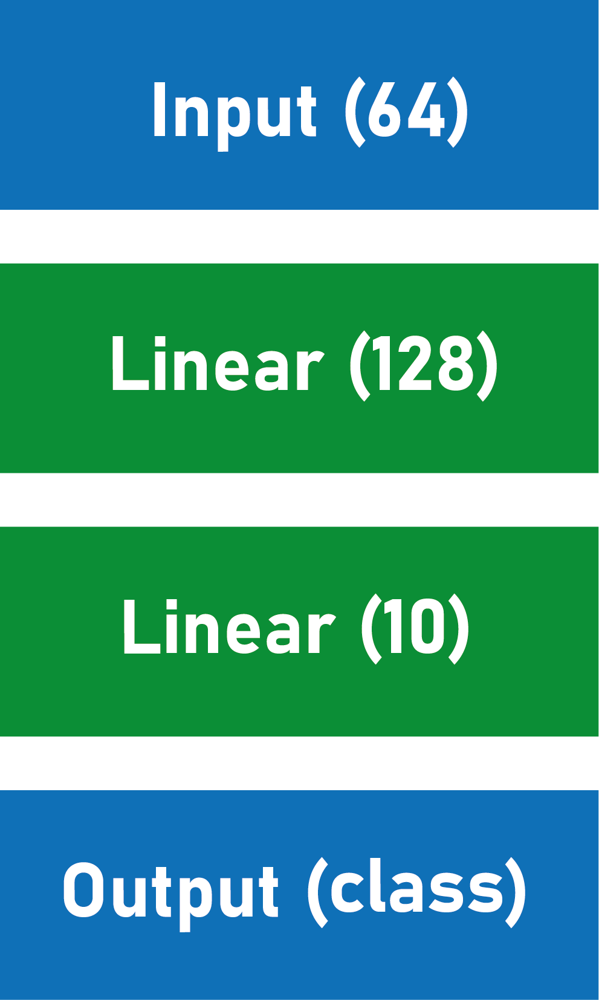

#  Single pixel imaging with classical and quantum neutral networks [classical-quantum-mnist]

Single-pixel cameras can be a great solution for the light outside of the visible spectrum. In combination with machine learning, they will allow to quickly analyze images for the practical applications. In the future development of quantum technologies, quantum computers can further speed up the solution of such problems. In this work we simulated a single-pixel detection experiment using Hadamard basis patterns, where images from the MNIST are used as objects. 64 measurements (6% of the number of pixels in the image) with maximum variance were selected. The algorithms for classifying and reconstucting images in single-pixel experiment using classical fully connected neural networks and quantum variational circuits were created. Quantum neural networks were used for the first time to solve this type of problem.

## Repository description

Here you can find four jupyther notebooks written in python. Every library you need is installed in notebooks.

<table>
    <tr>
        <th>Filename</th>
        <th>Description</th>
    </tr>
    <tr>
        <td>Classical_Classification_with_noise.ipynb</td>
        <td>"single-pixel images" (64 measurements in Hadamard patterns basis) were classified using fully-connected network</td>
    </tr>
    <tr>
        <td>Classical_Reconstruction.ipynb</td>
        <td>"single-pixel images" were reconstrusted by the fully-connected network</td>
    </tr>
    <tr>
        <td>Quantum_Classification.ipynb</td>
        <td>"single-pixel images" were classified using quantum neural network (variational quantum circuits)</td>
    </tr>
    <tr>
        <td>Quantum_Reconstruction_dense.ipynb</td>
        <td>"single-pixel images" were reconstructed by the quantum neural network</td>
    </tr>
</table>

Each file consists of creating the dataset of measurements in single-pixel experiment from the MNIST, model and training (with loss plot).

## Models architecture and description

- Classical classifier [PyTorch]

For the classic solution, fully connected linear neural networks were used. The architecture of the classifier consists of two hidden layers (128 and 10 neurons, respectively, that is, 9610 trainable parameters).

Other parameters: number of epochs – 6, loss function - Cross-Entropy loss, activation function – ReLu, optimizer – Adam, learning rate – 0.001

- Classical reconstruction [PyTorch]

The architecture consists of five hidden layers (1000, 2000, 4000, 2000 and 1024 neurons, that is, 20,122,024 trainable parameters).

Other parameters: number of epochs – 6, loss function MSE, activation function – ReLu, optimizer – Adam, learning rate – 0.001

- Quantum classifier [PennyLane]

To develop the quantum algorithm for classifying “single-pixel images” using quantum neural networks the variational quantum circuit was created. The circuit consists of 6 qubits (log2 64), where “single-pixel image” can be encoded using amplitude embedding, 6 strongly entangled layers (consisting of R(angle_1, angle_2, angle_3) and CNOT gates) with different trainable parameters (108 angles of qubits rotations - trainable parameters) and one measurement of the Z -observable of first qubit. This circuit is a binary classifier that determines the probability of our data to belong to one of the classes or to all others (it solves a binary problem, where 1 means belonging to this class, -1 to some of the others). Thus, for classification into 10 classes, we need 10 binary classifiers, each has its own set of parameters and trains independently of the others (in total 1090 trainable parameters, (108 angles + 1 bias) x 10).

Other parameters: number of epochs – 3, loss function – Margin loss, margin = 0.15, optimizer – Adam, learning rate – 0.01

[CHANGE IMAGE]

- Quantum reconstruction [PennyLane]

Because of the long traing on the quantum simulator we decide to use a little part of the MNIST dataset (640 images of zeros and 640 of ones).
For the task of quantum image reconstruction, it was developed the architecture of a variational quantum circuit consisting of 10 qubits, 6 of which were initialized in a state defined as AmplitudeEmbedding(measurements) and the others in zero state. After [NUMBER] real amplitude layers (consisting only of Ry and CNOT gates) the state of the system was measured (which is the 1024 numbers - pixels of the image), in total it used [NUMBER] trainable parameters.

Other parameters: number of epochs – 10, loss function – CosineSimilarity, optimizer – Adam, learning rate – 0.5

[CHANGE IMAGE]

## Research results

- The classical classifier showed an accuracy of 97% after six training epochs
- The quantum classifier showed an accuracy of 93% after three (because quantum simulating is too long) training epochs
- The true and recovered from different number of measurements images using classical neural network:

[IMAGE]

- The true and recovered images using classical neural network and different loss types:

[IMAGE]

**Here you can find the more detailed results of the research:** [SOON]
